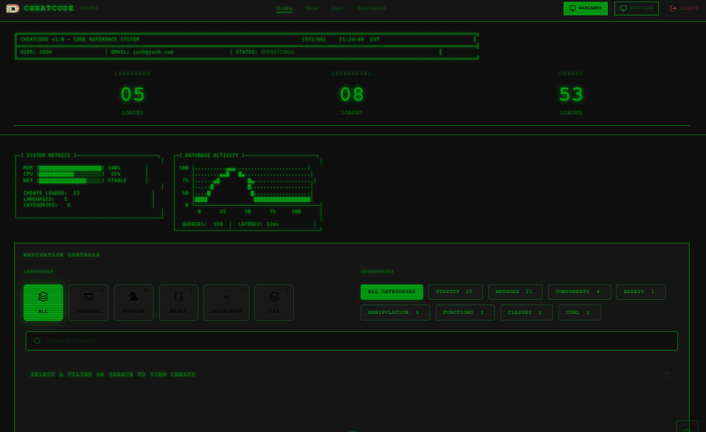
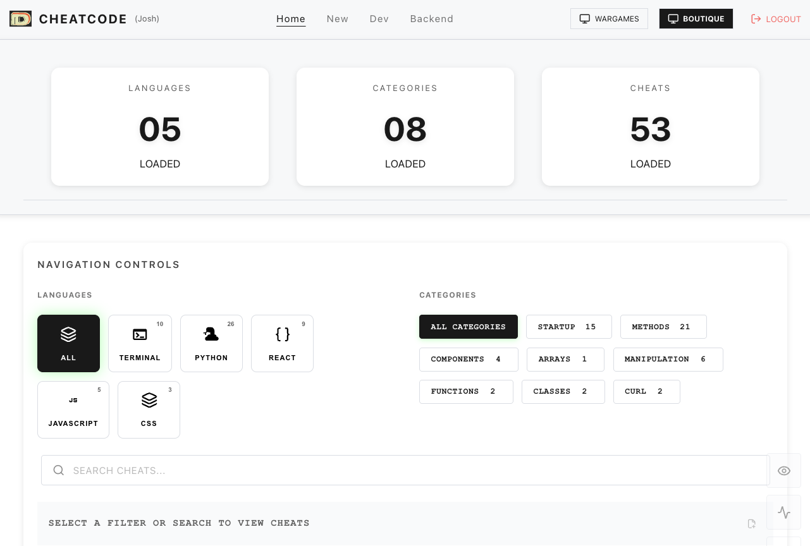
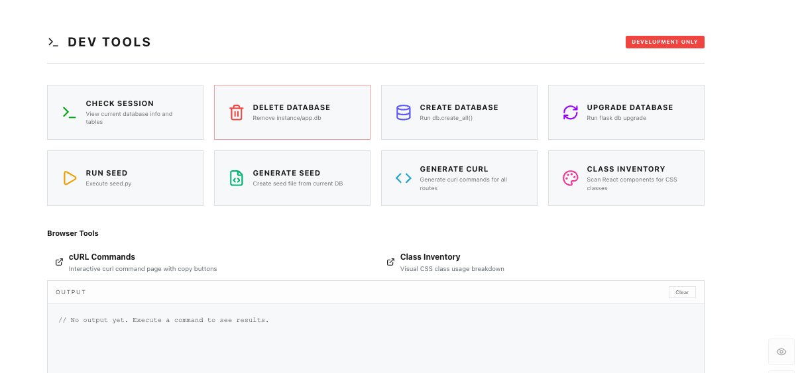

# CheatCode

A personal code snippet manager with built-in developer tools, multiple themes, and a Flask backend generator.



## The Problem

You Google the same syntax every week. Array methods, SQL joins, React patterns—stuff you *know* but can't quite remember. Browser bookmarks get messy. Notes apps aren't built for code.

## The Solution

Your own searchable snippet library with dev tools baked in. Organize by language and category, find what you need in seconds, and use the built-in utilities to speed up your workflow.

## Features

- **Snippet Library** - Store code with title, syntax highlighting, and notes
- **Filter by Language** - JavaScript, Python, SQL, React, Terminal, CSS
- **Filter by Category** - Startup, Methods, Components, Arrays, Functions, and more
- **Quick Search** - Find any snippet instantly
- **Multiple Themes** - Clean light mode or Wargames hacker aesthetic
- **User Accounts** - Your snippets, your library



## Dev Tools

Built-in utilities for developers—not just a snippet manager:



- **Flask CRUD Generator** - Generate models, routes, and serializers from a visual table builder
- **Database Controls** - Create, delete, upgrade, and seed your database from the UI
- **Dynamic Seed Generator** - Auto-generate seed files from your current database
- **cURL Generator** - Generate curl commands for all your routes
- **Class Inventory** - Scan React components for CSS class usage

## Tech Stack

| Frontend | Backend |
|----------|---------|
| React | Flask |
| React Router | SQLAlchemy |
| Context API | Flask-RESTful |
| CSS (multiple themes) | Flask-Bcrypt |

## Live Demo

**[→ View Live Demo](https://josdic1.github.io/cheatsheet_mvp/)**

## Run Locally

```bash
# Backend
cd server
python -m venv venv
source venv/bin/activate
pip install -r requirements.txt
python seed.py
python run.py

# Frontend (new terminal)
cd client
npm install
npm run dev
```

Backend: `http://localhost:5555`  
Frontend: `http://localhost:5173`

## About

Built to solve my own problem—I was tired of re-Googling the same patterns. The dev tools grew out of wanting to speed up my own Flask workflow.